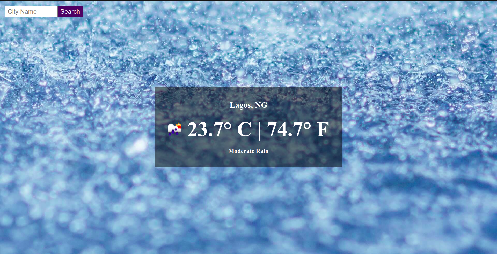

# Javascript Weather App
> This App gets the weather of a particular location and also the location of the user using the app.
A user can input the name of a city and the app retrieves the weather for that location.
The app makes use of GeoLocation API to get the location of the current user.
This is part of the Weather-App Project in [The Odin Project's](https://www.theodinproject.com/courses/javascript/lessons/weather-app?ref=lnav) Javascript Curriculum.



[Demo Link](https://rawcdn.githack.com/OlawaleJoseph/WeatherApp/ab13beeef56acfcf17e521f20b52804fce03f6fa/dist/index.html)


## Implementations
- Get user location via GeoLocation API.
- If the permission is granted, the application gets the user's location information and searches for the current weather of that location.
- If the permission is denied, the application gets the current weather of Lagos, a city in Nigeria.
- User can toggle to see temperatures in Celcius or Fahrenheit


## Built With

- Javascript (Fetch, ES6)
- HTML
- CSS

## Getting Started

To get a local copy up and running follow these simple example steps.

- Clone the repository and there you go! ;-)

### Prerequisites

- Get a browser like Chrome and Firefox in their most recent versions
- Code Editor (VSCode)

### Setup

- Open a terminal and run the command ```git clone https://github.com/OlawaleJoseph/WeatherApp.git```
- cd WeatherApp
- run ```npm install```
- run ```npm run build```
- Open the index.html file with any browser of your choice.

### for webpack run:
 ```npm run build```

## Author

👤 **Adedeko Olawale**

- Github: [@OlawaleJoseph](https://github.com/OlawaleJoseph)
- Twitter: [@javanode123](https://twitter.com/javanode123)
- Linkedin: [olawale-adedeko](http://www.linkedin.com/in/olawale-adedeko)


## 🤝 Contributing

Contributions, issues and feature requests are welcome!

Feel free to check the [issues page](https://github.com/OlawaleJoseph/Resturant/issues).

## Show your support

Give a ⭐️ if you like this project!
